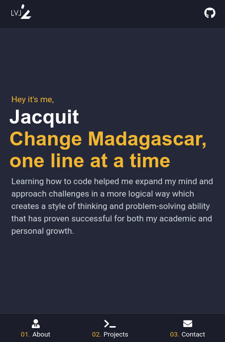
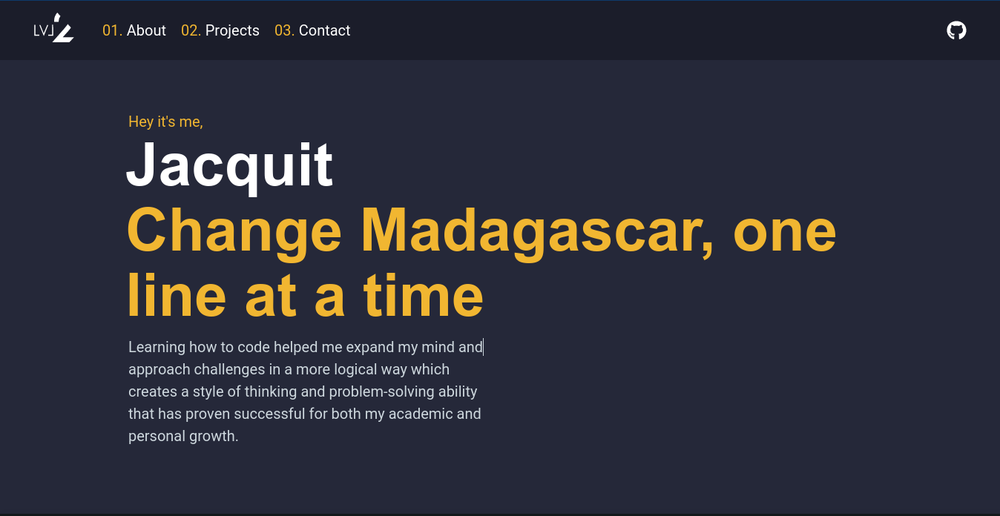

# **Jacquit's Portfolio**
 
<div align="center">
  <h3>
    <a href="https://jacquit-portfolio.netlify.app/" target="_blank">
      Demo
    </a>
    <span> | </span>
    <a href="https://github.com/Tanosimboangy/Jacquit-portfolio" target="_blank">
      Source
    </a>
  </h3>
</div>

## __Description:__
This is my Portfolio, which is built with gatsby. It is more about me and the projects that I have built.
 
## __Technology__
- [Gatsby](https://www.gatsbyjs.com/docs/)
- [Styled Components](https://styled-components.com/)

## __Design__



## __Prerequisites:__

**If you want to run this project in you local machine, clone it and follow these few steps:**

```bash
# Clone this repository to your local computer
$ git clone https://github.com/Tanosimboangy/Jacquit-portfolio.git

# Install dependencies
$ yarn install

# Run the app
$ yarn develop
```
## __Contact :__
$ GitHub [Tanosimboangy](https://github.com/Tanosimboangy)
